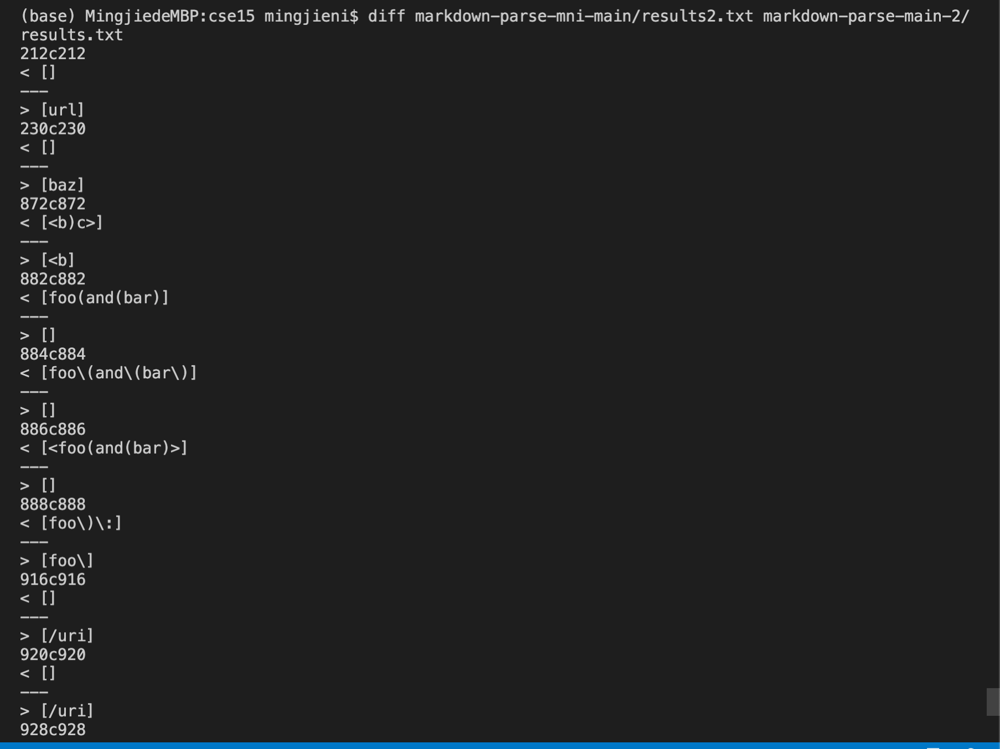

# Lab Report 5


## How you found the tests with different results
I used the `diff` command in the terminal to compare the ouputs of Joe's `markdown-parse` and my group's `markdown-parse` and mannully find which test is different from the `results.txt` file.



On line 230, test file 201 fails.
## Contents of Test File 201.md
```
[foo]: <bar>(baz)

[foo]
```
**Joe's Output:** `[baz]` 

**Group Output:** `[]`

As `201.md` does not contain a valid link, my group markdownparse works.

The bug in Joe's code arises because of the lack of checking if the open parenthesis comes immediately after the close bracket and is listed as the following:

### Joe's Markdown Parse
```
int closeParen = findCloseParen(markdown, openParen);

if(nextOpenBracket == -1 || nextCloseBracket == -1
        || closeParen == -1 || openParen == -1) {
    return toReturn;
}
```
This only checks the  open and close parentheses as well as open and close brackets and therefore falsely includes `baz`.

On line 928, Test File 516.md fails.

## Contents of Test File 516.md
```
[](/uri)
```
**Joe's Output:** `[/uri]` 

**Group Output:** `[moon.jpg)](/uri]`

Joe's ouput correctly gives the link while our group falsely includes the `moon.jpg`.

The bug in my group's implementation is that the code checks for the first instance of "pivotal sequence" or the sequence ")。This usually works but `516.md` has two instances of pivotal sequence and the link actually starts at the second pivotal sequence. Our code falsely recognize the first instance as the start.

### Group's Markdown Parse
```
int firstBracket = s.indexOf("[");
int pivotalSeq = s.indexOf("](");
boolean containerGood = false;
String linkContainer = "";
//this obtains the whole container like [Link]
if (firstBracket >=0 && pivotalSeq > firstBracket)
    linkContainer = s.substring(firstBracket,pivotalSeq+1);
``` 
My group's code needs to determine which  pivotal sequence is the correct one to make it work for `516.md`.
